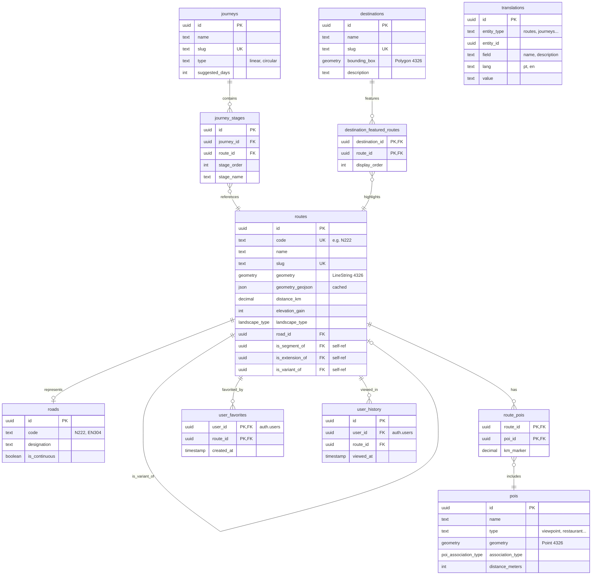

# Database Schema

> Complete database structure for Moto Routes.

---

## Overview

The database uses **PostgreSQL with PostGIS** for geographic data. All geometry is stored in SRID 4326 (WGS84).

**Critical Rule**: Coordinates are always `(longitude, latitude)` - longitude first!

---

## Entity Relationship Diagram



> **Nota**: Este diagrama renderiza automaticamente no GitHub. Para ver localmente, usa um editor com suporte Mermaid (VS Code + extensão, ou cola em [mermaid.live](https://mermaid.live)).

---

## Tables

### Core Tables

#### `routes`

The main entity. Every route **must have** a geometry.

| Column | Type | Description |
|--------|------|-------------|
| id | uuid | Primary key |
| code | text | Route code (e.g., "N222") |
| name | text | Display name |
| slug | text | URL-friendly identifier |
| description | text | Route description |
| geometry | geometry(LineString, 4326) | PostGIS geometry |
| geometry_geojson | json | Cached GeoJSON for frontend |
| distance_km | decimal | Total distance |
| elevation_max | integer | Maximum elevation (m) |
| elevation_min | integer | Minimum elevation (m) |
| elevation_gain | integer | Total elevation gain (m) |
| elevation_loss | integer | Total elevation loss (m) |
| curve_count_total | integer | Total number of curves |
| curve_count_gentle | integer | Gentle curves |
| curve_count_moderate | integer | Moderate curves |
| curve_count_sharp | integer | Sharp curves |
| surface | text | Road surface type |
| difficulty | text | Difficulty rating |
| landscape_type | landscape_type | Type of landscape (ENUM) |
| data_source | text | Source of GPX data |
| road_id | uuid | Reference to abstract road |
| is_segment_of | uuid | Parent route (if segment) |
| is_extension_of | uuid | Parent route (if extension) |
| is_variant_of | uuid | Parent route (if variant) |
| created_at | timestamp | Creation timestamp |
| updated_at | timestamp | Last update timestamp |

#### `journeys`

Multi-stage trip compositions.

| Column | Type | Description |
|--------|------|-------------|
| id | uuid | Primary key |
| name | text | Journey name |
| slug | text | URL-friendly identifier |
| type | text | Journey type (linear, circular, etc.) |
| description | text | Journey description |
| suggested_days | integer | Suggested number of days (default: 1) |
| created_at | timestamp | Creation timestamp |
| updated_at | timestamp | Last update timestamp |

#### `journey_stages`

Links journeys to routes with ordering.

| Column | Type | Description |
|--------|------|-------------|
| id | uuid | Primary key |
| journey_id | uuid | Reference to journey |
| route_id | uuid | Reference to route |
| stage_order | integer | Order in journey |
| stage_name | text | Stage display name |

#### `destinations`

Geographic regions for discovery.

| Column | Type | Description |
|--------|------|-------------|
| id | uuid | Primary key |
| name | text | Destination name |
| slug | text | URL-friendly identifier |
| bounding_box | geometry(Polygon, 4326) | Geographic bounds |
| description | text | Destination description |
| created_at | timestamp | Creation timestamp |
| updated_at | timestamp | Last update timestamp |

#### `destination_featured_routes`

Links destinations to their highlighted routes.

| Column | Type | Description |
|--------|------|-------------|
| destination_id | uuid | Reference to destination |
| route_id | uuid | Reference to route |
| display_order | integer | Sort order (default: 0) |

#### `pois`

Points of interest.

| Column | Type | Description |
|--------|------|-------------|
| id | uuid | Primary key |
| name | text | POI name |
| type | text | POI type (viewpoint, restaurant, fuel_station, etc.) |
| geometry | geometry(Point, 4326) | Location |
| description | text | POI description |
| association_type | poi_association_type | Relation to route |
| distance_meters | integer | Distance from route |
| created_at | timestamp | Creation timestamp |
| updated_at | timestamp | Last update timestamp |

#### `route_pois`

Links routes to POIs.

| Column | Type | Description |
|--------|------|-------------|
| route_id | uuid | Reference to route |
| poi_id | uuid | Reference to POI |
| km_marker | decimal | Position on route (km from start) |

---

### User Tables

#### `user_favorites`

User's saved routes. RLS enforces users can only access their own rows.

| Column | Type | Description |
|--------|------|-------------|
| user_id | uuid | Reference to auth.users (PK) |
| route_id | uuid | Reference to route (PK) |
| created_at | timestamp | When favorited |

#### `user_history`

Routes viewed by user. RLS enforces users can only access their own rows.

| Column | Type | Description |
|--------|------|-------------|
| id | uuid | Primary key |
| user_id | uuid | Reference to auth.users |
| route_id | uuid | Reference to route |
| viewed_at | timestamp | When viewed |

---

### Support Tables

#### `roads`

Abstract road designations (optional reference).

| Column | Type | Description |
|--------|------|-------------|
| id | uuid | Primary key |
| code | text | Road code (N222, EN304) |
| designation | text | Official designation |
| status | text | Road status |
| is_continuous | boolean | Is continuous road |
| description | text | Road description |
| wikipedia_url | text | Wikipedia link |
| created_at | timestamp | Creation timestamp |
| updated_at | timestamp | Last update timestamp |

#### `translations`

i18n support for content. One row per `(entity_type, entity_id, field, lang)`.

| Column | Type | Description |
|--------|------|-------------|
| id | uuid | Primary key |
| entity_type | text | Table name (routes, journeys, destinations, pois) |
| entity_id | uuid | Record ID |
| field | text | Field name (name, description) |
| lang | text | Language code (pt, en) |
| value | text | Translated value |
| created_at | timestamp | Creation timestamp |
| updated_at | timestamp | Last update timestamp |

---

## ENUMs

### `landscape_type`

Used on `routes.landscape_type`. The `get_destinations()` RPC also casts this field from `destinations`.

```sql
CREATE TYPE landscape_type AS ENUM (
  'coast',
  'mountain',
  'forest',
  'urban',
  'river_valley',
  'mixed',
  'plains'
);
```

### `poi_association_type`

```sql
CREATE TYPE poi_association_type AS ENUM (
  'on_route',    -- Exactly on the route
  'near_route',  -- Close, no detour needed
  'detour'       -- Requires leaving route
);
```

---

## Indexes

### Spatial Indexes

```sql
CREATE INDEX routes_geometry_idx ON routes USING GIST (geometry);
CREATE INDEX pois_geometry_idx ON pois USING GIST (geometry);
CREATE INDEX destinations_bbox_idx ON destinations USING GIST (bounding_box);
```

### Foreign Key Indexes

```sql
CREATE INDEX journey_stages_journey_idx ON journey_stages (journey_id);
CREATE INDEX journey_stages_route_idx ON journey_stages (route_id);
CREATE INDEX route_pois_route_idx ON route_pois (route_id);
CREATE INDEX route_pois_poi_idx ON route_pois (poi_id);
CREATE INDEX user_favorites_user_idx ON user_favorites (user_id);
CREATE INDEX user_favorites_route_idx ON user_favorites (route_id);
CREATE INDEX user_history_user_idx ON user_history (user_id);
CREATE INDEX user_history_route_idx ON user_history (route_id);
CREATE INDEX destination_featured_routes_dest_idx ON destination_featured_routes (destination_id);
```

### Lookup Indexes

```sql
-- URL lookups (critical for frontend routing)
CREATE INDEX routes_slug_idx ON routes (slug);
CREATE INDEX routes_code_idx ON routes (code);
CREATE INDEX journeys_slug_idx ON journeys (slug);
CREATE INDEX destinations_slug_idx ON destinations (slug);

-- Filter indexes
CREATE INDEX routes_landscape_type_idx ON routes (landscape_type);

-- Translation lookups
CREATE INDEX translations_entity_idx ON translations (entity_type, entity_id);
```

---

## Row Level Security (RLS)

### Public Read Access

```sql
-- Routes, journeys, destinations, POIs, roads, translations are public
CREATE POLICY "Public read access" ON routes
  FOR SELECT TO public USING (true);

CREATE POLICY "Public read access" ON journeys
  FOR SELECT TO public USING (true);

CREATE POLICY "Public read access" ON destinations
  FOR SELECT TO public USING (true);

CREATE POLICY "Public read access" ON pois
  FOR SELECT TO public USING (true);
```

### User-Specific Access

```sql
-- Favorites: users can only access their own
CREATE POLICY "Users read own favorites" ON user_favorites
  FOR SELECT TO authenticated
  USING (auth.uid() = user_id);

CREATE POLICY "Users insert own favorites" ON user_favorites
  FOR INSERT TO authenticated
  WITH CHECK (auth.uid() = user_id);

CREATE POLICY "Users delete own favorites" ON user_favorites
  FOR DELETE TO authenticated
  USING (auth.uid() = user_id);

-- History: same pattern
CREATE POLICY "Users read own history" ON user_history
  FOR SELECT TO authenticated
  USING (auth.uid() = user_id);

CREATE POLICY "Users insert own history" ON user_history
  FOR INSERT TO authenticated
  WITH CHECK (auth.uid() = user_id);
```

---

## RPC Functions

PostgreSQL functions exposed via Supabase REST API (`supabase.rpc()`).

### `get_pois_for_route`

Returns POIs for a given route with extracted coordinates. PostGIS geometry columns return `null` in the JS client — this function uses `ST_X`/`ST_Y` to convert coordinates.

**Signature** (from `schema.sql`):
```sql
get_pois_for_route(p_route_id uuid)
RETURNS TABLE (
  id               uuid,
  name             text,
  description      text,
  poi_type         text,         -- POI category
  association_type poi_association_type,
  km_marker        numeric,      -- position on route in km
  longitude        double precision,
  latitude         double precision
)
```

**Usage (TypeScript)**:
```typescript
const { data } = await supabase
  .rpc('get_pois_for_route', { p_route_id: routeId } as never)
// Note: `as never` needed due to Supabase RPC TypeScript inference
```

**Orders by**: `km_marker ASC`

---

### `get_destinations`

Returns all destinations with bounding box as GeoJSON (PostGIS geometry columns return `null` in the JS client — this function uses `ST_AsGeoJSON` to convert).

**Signature** (from `schema.sql`):
```sql
get_destinations()
RETURNS TABLE (
  id                  uuid,
  name                text,
  slug                text,
  description         text,
  landscape_type      text,
  bounding_box_geojson json
)
```

**Usage (TypeScript)**:
```typescript
const { data } = await supabase
  .rpc('get_destinations', {} as never)
```

---

## Common Queries

### Get route with GeoJSON

```sql
SELECT
  id, name, slug, description,
  distance_km, elevation_gain,
  landscape_type,
  geometry_geojson
FROM routes
WHERE slug = 'n222-vale-do-douro';
```

### Get POIs for a route (frontend — via RPC)

```typescript
// Use RPC — PostGIS geometry columns return null in JS client
const { data } = await supabase
  .rpc('get_pois_for_route', { p_route_id: routeId } as never)
// Returns: { id, name, description, poi_type, association_type, km_marker, longitude, latitude }[]
```

### Get POIs for a route (SQL — backend/migrations)

```sql
SELECT p.id, p.name, p.type,
  ST_X(p.geometry::geometry) AS longitude,
  ST_Y(p.geometry::geometry) AS latitude,
  rp.km_marker
FROM pois p
JOIN route_pois rp ON rp.poi_id = p.id
WHERE rp.route_id = $1
ORDER BY rp.km_marker;
```

### Find routes within distance

```sql
SELECT r.*
FROM routes r
WHERE ST_DWithin(
  r.geometry::geography,
  ST_MakePoint($lon, $lat)::geography,
  50000  -- 50km radius
);
```

### Get route bounding box

```sql
SELECT
  ST_XMin(ST_Extent(geometry)) as min_lon,
  ST_YMin(ST_Extent(geometry)) as min_lat,
  ST_XMax(ST_Extent(geometry)) as max_lon,
  ST_YMax(ST_Extent(geometry)) as max_lat
FROM routes
WHERE id = $1;
```

---

## Related Documents

- [Architecture](./ARCHITECTURE.md) - System design
- [Patterns](./PATTERNS.md) - Query patterns and best practices
